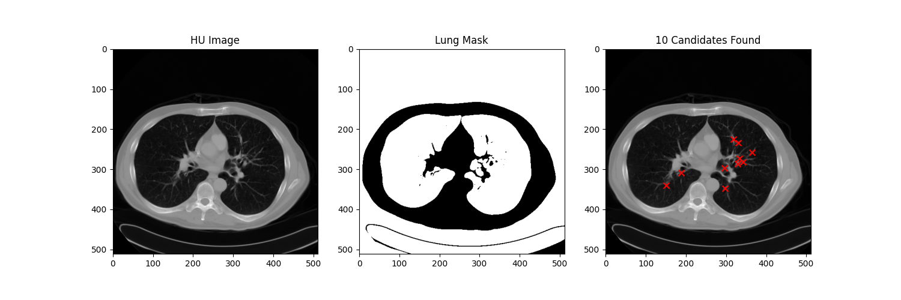

# 🫁 Lung Cancer Detection System

AI-powered lung nodule candidate detection from chest CT scans.
Built as a complete end-to-end medical AI project over 30 days.


---

## 🎯 What This Project Does

This system takes a chest CT scan (DICOM format) as input and:

1. **Loads** the DICOM file and extracts patient metadata
2. **Preprocesses** the scan (Hounsfield Unit conversion, clipping, normalization)
3. **Segments** the lung tissue from surrounding structures (ribs, spine, heart)
4. **Detects** suspicious nodule candidates inside the lungs
5. **Returns** candidate locations, sizes, and density values
6. **Displays** results in a clinical-style web interface with red circle annotations

---

## 🖥️ Demo



### Web Interface (Streamlit)
- Upload any DICOM (.dcm) file
- View CT scan with candidate locations marked in red
- See patient information (ID, age, scanner)
- Download CSV report of all candidates
- Automatic warnings for unusual scan quality

### REST API (FastAPI)
- `POST /analyze` → upload scan, receive JSON results instantly
- `GET /health` → check if API is running
- `GET /results/{scan_id}` → retrieve results of previous scan
- `GET /results` → list all analyzed scans
- Interactive API documentation at `http://localhost:8000/docs`

---

## 📊 Performance & Results

| Metric | Value |
|--------|-------|
| Candidates detected (sample scan) | 10 |
| Pipeline steps | 5 |
| Inference time (FP32) | ~0.43ms per patch |
| Inference time (INT8 quantized) | ~0.63ms per patch |
| Model size (FP32) | 3.22 MB |
| Model size (INT8) | ~0.8 MB |
| Lung pixels detected | 196,328 |
| Automatic quality warnings | ✅ |
| Error handling | ✅ |

> ⚠️ Note: This project uses a classical candidate detection pipeline.
> Training the neural network classifier on LUNA16 labeled data is the next step
> toward achieving competitive FROC sensitivity scores.

---

## 🏗️ System Architecture

```
DICOM File (.dcm)
        ↓
[1] load_dicom.py
    → Read DICOM, extract metadata (patient ID, age, scanner)
    → Validate required fields (RescaleSlope, RescaleIntercept)
        ↓
[2] preprocess.py
    → Convert raw pixels to Hounsfield Units (HU = pixel × slope + intercept)
    → Clip HU values to [-1000, 400]
    → Normalize to [0.0, 1.0]
        ↓
[3] segmentation.py
    → Threshold at -400 HU to create binary lung mask
    → Apply morphological erosion + dilation to clean mask
    → Label connected components, keep 2 largest (lungs)
        ↓
[4] pipeline.py
    → Fill holes in lung mask (solid lung boundary)
    → Subtract original mask to find internal structures
    → Extract candidates: centroid (x,y), area, mean_intensity
        ↓
[5] Output
    → Candidates DataFrame → CSV file
    → Annotated CT scan image → PNG file
    → Clinical report → printed + displayed in app
        ↓
┌─────────────────┐    ┌─────────────────┐
│  Streamlit App  │    │   FastAPI REST   │
│  (Visual UI)    │    │   (Machine API)  │
│  localhost:8502 │    │  localhost:8000  │
└─────────────────┘    └─────────────────┘
```

---

## 🛠️ Complete Tech Stack

| Component | Technology | Purpose |
|-----------|-----------|---------|
| Language | Python 3.10 | Core development |
| Deep Learning | PyTorch 2.0 | CNN models, training |
| Medical Imaging | pydicom | DICOM file handling |
| Image Processing | scikit-image, OpenCV | Segmentation, morphology |
| Scientific Computing | NumPy, SciPy | Array operations, fill holes |
| Data Analysis | Pandas | Candidate DataFrames |
| Visualization | Matplotlib | CT scan plots, heatmaps |
| Web Interface | Streamlit | Clinical UI |
| REST API | FastAPI + Uvicorn | Machine-to-machine API |
| Model Export | ONNX | Cross-platform deployment |
| Augmentation | TorchIO | Medical image augmentation |
| Notebooks | Jupyter | Data exploration |

---

## 🚀 Quick Start

### Prerequisites
- Anaconda or Miniconda installed
- A chest CT scan in DICOM format (.dcm)

### Step 1 — Clone the repository
```bash
git clone https://github.com/YOUR_USERNAME/lung-cancer-detection.git
cd lung-cancer-detection
```

### Step 2 — Create virtual environment
```bash
conda create -n lungcancer python=3.10
conda activate lungcancer
```

### Step 3 — Install all dependencies
```bash
pip install -r requirements.txt
```

### Step 4 — Add your DICOM file
```bash
# Place your .dcm file here:
data/raw/sample.dcm
```

### Step 5 — Run the Streamlit web app
```bash
streamlit run src/app/app.py
# Opens automatically at http://localhost:8502
```

### Step 6 — Or run the REST API
```bash
python src/app/api.py
# Visit http://localhost:8000/docs for interactive documentation
```

### Step 7 — Or run the full pipeline directly
```bash
python src/full_pipeline.py
# Processes data/raw/sample.dcm and saves results to outputs/
```

---

## 📁 Complete Project Structure

```
lung-cancer-detection/
├── data/
│   └── raw/                         ← Place DICOM files here
│       └── sample.dcm
├── notebooks/
│   └── exploration.ipynb            ← Dataset exploration + Day 3 analysis
├── outputs/                         ← Generated images, CSVs, models
│   ├── day1_ct_slice.png            ← NumPy normalization demo
│   ├── day2_raw_ct_scan.png         ← Raw DICOM visualization
│   ├── day3_nodule_distribution.png ← Nodule size histogram
│   ├── day4_preprocessing.png       ← HU conversion pipeline
│   ├── day5_segmentation.png        ← Binary lung mask
│   ├── day6_lung_mask.png           ← Connected components
│   ├── day7_mini_project.png        ← Full Week 1 pipeline
│   ├── day15_augmentation.png       ← Augmentation demo
│   ├── day16_attention.png          ← Attention weight heatmap
│   ├── day18_gradcam.png            ← Grad-CAM visualization
│   ├── day21_clinical_metrics.png   ← Sensitivity vs PPV curve
│   ├── day22_full_pipeline.png      ← Complete pipeline output
│   ├── model.onnx                   ← Exported ONNX model
│   ├── nodule_candidates.csv        ← Detected candidates
│   └── final_candidates.csv         ← Final pipeline candidates
├── src/
│   ├── preprocessing/
│   │   ├── load_dicom.py            ← DICOM loading + metadata
│   │   ├── preprocess.py            ← HU conversion + normalization
│   │   ├── segmentation.py          ← Lung segmentation
│   │   ├── pipeline.py              ← Candidate detection
│   │   └── augmentation.py          ← Data augmentation (flip, rotate, noise)
│   ├── models/
│   │   ├── cnn_2d.py                ← SimpleCNN (2D binary classifier)
│   │   ├── cnn_3d.py                ← SimpleCNN3D (volumetric classifier)
│   │   ├── unet.py                  ← MiniUNet (lung segmentation)
│   │   ├── resnet_transfer.py       ← ResNet-18 transfer learning
│   │   ├── attention.py             ← Self-attention mechanism
│   │   ├── malignancy_classifier.py ← Multimodal malignancy scoring
│   │   └── ensemble.py              ← Ensemble (average + majority vote)
│   ├── training/
│   │   └── train.py                 ← Weighted BCE + Focal loss
│   ├── evaluation/
│   │   ├── metrics.py               ← IoU calculation
│   │   ├── clinical_metrics.py      ← Sensitivity, Specificity, PPV, NPV
│   │   ├── grad_cam.py              ← Grad-CAM explainability
│   │   └── froc_simulation.py       ← FROC false positive reduction
│   ├── optimization/
│   │   └── model_optimizer.py       ← ONNX export + INT8 quantization
│   ├── app/
│   │   ├── app.py                   ← Streamlit clinical interface
│   │   └── api.py                   ← FastAPI REST endpoint
│   └── full_pipeline.py             ← End-to-end integrated pipeline
├── requirements.txt                 ← All dependencies
└── README.md                        ← You are here
```

---

## 🧠 Models Built

| Model | Architecture | Purpose | File |
|-------|-------------|---------|------|
| SimpleCNN | 2D CNN (conv1→conv2→fc1→fc2→sigmoid) | Nodule patch classification | cnn_2d.py |
| SimpleCNN3D | 3D CNN (Conv3d layers) | Volumetric nodule classification | cnn_3d.py |
| ResNet-18 | Pretrained ImageNet → fine-tuned | Transfer learning classifier | resnet_transfer.py |
| MiniUNet | Encoder-decoder + skip connections | Lung segmentation | unet.py |
| SelfAttention | Q/K/V attention mechanism | Long-range dependency modeling | attention.py |
| MalignancyClassifier | 3D CNN + clinical features | Multimodal malignancy scoring | malignancy_classifier.py |
| EnsembleModel | Average + majority vote + uncertainty | Robust combined predictions | ensemble.py |

---

## 🔬 Key Concepts Implemented

### Week 1 — Classical Pipeline
- DICOM loading and metadata extraction
- Hounsfield Unit conversion and windowing
- Lung segmentation via thresholding + morphological operations
- Connected component analysis
- Nodule candidate detection (fill-holes method)

### Week 2 — Deep Learning
- 2D and 3D Convolutional Neural Networks
- Transfer learning with pretrained ResNet-18
- U-Net encoder-decoder architecture with skip connections
- IoU (Intersection over Union) calculation
- Non-Maximum Suppression (NMS) concepts
- False positive reduction pipeline

### Week 3 — Advanced Techniques
- Data augmentation (flip, rotate, Gaussian noise)
- Self-attention mechanism from scratch
- Weighted cross-entropy and Focal loss for class imbalance
- Grad-CAM explainability / interpretability
- Multimodal malignancy prediction (image + clinical features)
- Ensemble models with uncertainty quantification
- Clinical validation metrics (Sensitivity, Specificity, PPV, NPV, FROC)

### Week 4 — Production Deployment
- Full pipeline integration with error handling
- PipelineError vs PipelineWarning classification
- ONNX model export for cross-platform deployment
- INT8 dynamic quantization (4x size reduction)
- Streamlit clinical web interface
- FastAPI REST API with automatic documentation
- Clinical disclaimer and regulatory awareness

---

## ⚠️ Limitations & Future Work

### Current Limitations
- Neural network classifiers not yet trained on LUNA16 labeled data
- Only processes single 2D DICOM slice (not full 3D volume stack)
- Classical candidate detection (no learned false positive reduction)
- No FROC evaluation on standardized test set
- In-memory result storage (not persistent database)

### Next Steps Toward Production
- [ ] Train SimpleCNN3D on LUNA16 labeled nodule patches
- [ ] Evaluate FROC sensitivity @ 1, 2, 4, 8 FP/scan on held-out test set
- [ ] Replace classical segmentation with trained U-Net
- [ ] Add PostgreSQL database for persistent result storage
- [ ] Implement federated learning for multi-hospital training
- [ ] Add HIPAA-compliant encryption for patient data
- [ ] Begin FDA 510(k) regulatory pathway planning

---

## 🏥 Clinical & Ethical Considerations

### Regulatory Status
This project is **NOT** FDA approved or CE marked. It has not undergone clinical validation trials.

### HIPAA Compliance
- Current implementation does NOT meet HIPAA requirements
- Patient data is stored in unencrypted temp files
- No audit logging or access controls implemented
- Production deployment would require full HIPAA compliance review

### Bias & Fairness
- Training data (LUNA16) consists primarily of Western patients
- Performance may vary across different populations, scanners, and institutions
- Subgroup analysis by age, sex, and ethnicity required before clinical deployment

### Clinical Disclaimer
> ⚠️ **For research and educational purposes only.**
> This tool is NOT approved for clinical diagnosis.
> All predictions must be reviewed by a qualified radiologist.
> Do not use for actual patient care decisions.
> The developer assumes no liability for clinical misuse.

---

## 📚 References & Datasets

| Resource | Link |
|----------|------|
| LUNA16 Dataset | https://luna16.grand-challenge.org/ |
| LIDC-IDRI Dataset | https://www.cancerimagingarchive.net/collection/lidc-idri/ |
| pydicom | https://pydicom.github.io/ |
| MONAI Framework | https://monai.io/ |
| Lung-RADS Guidelines | https://www.acr.org/Clinical-Resources/Reporting-and-Data-Systems/Lung-RADS |
| Focal Loss Paper | https://arxiv.org/abs/1708.02002 |
| U-Net Paper | https://arxiv.org/abs/1505.04597 |
| Grad-CAM Paper | https://arxiv.org/abs/1610.02391 |

---

## 👤 About

Built by **Isha Goyal** as a 30-day end-to-end medical AI learning project.

**Email:** ishagoyal4863@gmail.com
**LinkedIn:** https://www.linkedin.com/in/isha-goyal-366ba13ab?utm_source=share_via&utm_content=profile&utm_medium=member_android
**GitHub:** https://github.com/Isha-Goyal-1611

---

## 📄 License

This project is licensed under the MIT License.
See [LICENSE](LICENSE) for details.
